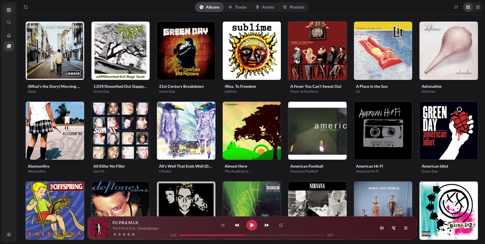
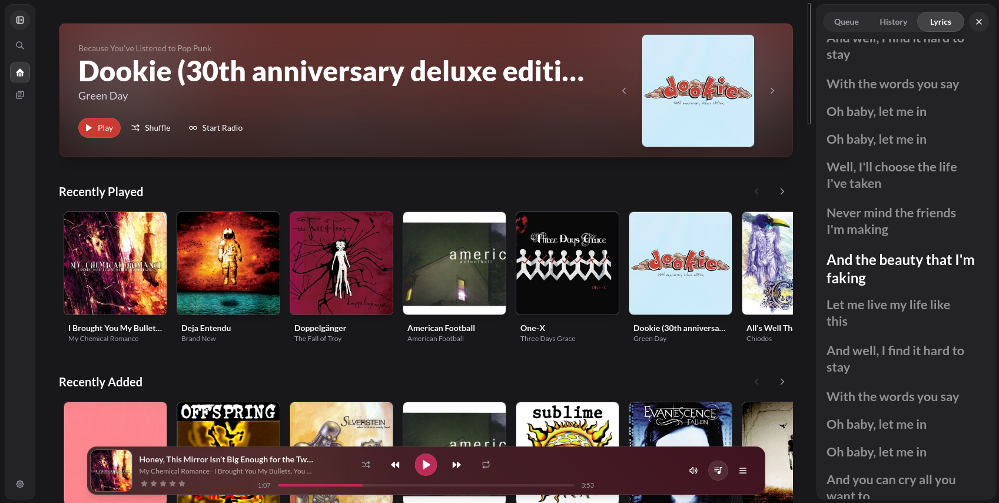

[](https://github.com/asavage7/finload/actions/workflows/ci.yml)
[](LICENSE)

Finload is a sleek and easy to use Jellyfin music player, with the goal to provide a more Spotify-like experience with your personal music library.

**Finload is nearing a beta-ready state with most major features working as intended.**

## AI Usage

**The UI and logo of Finload are not, and will never be, AI generated.**

However, parts of Finload were created with the help of artifical intelligence. While care is taken to ensure code remains well-tested, documented, and free of infringing works, these items cannot be guaranteed.


## Screenshots






## Features

- Onboarding Sequence
- Sync library from Jellyfin or local files
- Homepage with auto-generated recommendations based on listening history
- Library view (grid and list)
- Detail pages for albums, artists, playlists, and genres
- Playlists
- Gapless playback
- Queue, History, and Lyrics Panel
- Fullscreen "Now Playing" page
- Ratings for tracks and albums
- Autoplay for current queues
- Start radio from any Album, Artist, Track, or Playlist

**This is not an exhaustive list.**

### Known Issues

**- When launching the app, the backend falsely appears to be down. Please wait a second, right click, and select "Refresh". If the backend still appears to be down, please report an issue.**

- Switching between Jellyfin and Local files requires a restart to clear database issues
- Discovery algorithm needs tweaked, especially for isolated genres
- Library tabs sometimes need to be scrolled for content to appear
- Volume UI needs tweaked
- Autoplay toggle does not persist on queue clear
- Volume normalization does not adjust volume of non-normalized tracks, causing them to be much louder

## Install

Download finload from the [releases page](https://github.com/asavage7/finload/releases). x64 Linux is the only supported platform at the moment, however Windows and Linux ARM are planned.

**Debian / Ubuntu**:

```bash
sudo apt install ./finload_<version>_amd64.deb
```

**Fedora / openSUSE:**

```bash
sudo dnf install ./finload-<version>-1.x86_64.rpm
```

**Appimage:**

```bash
chmod +x finload_<version>_amd64.AppImage
./finload_<version>_amd64.AppImage
```

## Development

### Prerequisites

- Python 3.11+
- Node.js 20+ and npm 10+
- Rust 1.77+ if using Tauri
- libmpv (`libmpv2` on Debian/Ubuntu, `mpv` on Arch)

### Setup

Run the setup script for your platform. This installs system dependencies, creates the Python venv, and runs `npm install`:

```bash
# Linux / macOS
bash scripts/setup-dev.sh

# Windows (PowerShell)
.\scripts\setup-dev.ps1
```

### Running the app

Start the frontend and backend together:

```bash
npm run dev:all
```

For the full desktop shell (Tauri):

```bash
npm run dev:tauri
```

On first launch, the app will take you through an onboarding process. After this, credentials can be changed in Settings, or by restarting the onboarding process.

## Building

```bash
# All three Linux bundles, each with the correct mpv handling (see below)
npm run build:linux

# Or one target at a time
npm run build:tauri:deb
npm run build:tauri:rpm
npm run build:tauri:appimage

# Completed builds land in src-tauri/target/release/bundle/
```

Builds run PyInstaller over `src-backend/` to produce the sidecar binary, so the venv at `src-backend/.venv` has to exist first (`scripts/setup-dev.sh` creates it). PyInstaller cannot cross-compile, so each platform has to be built on itself.

### How libmpv gets bundled

python-mpv loads `libmpv.so.2` through `ctypes` at runtime rather than linking it, so it never appears as a `DT_NEEDED` entry and neither dpkg's `shlibdeps` nor rpm's soname scanner will find it. Each bundle declares it by hand in `src-tauri/tauri.conf.json`, and the release workflow checks the built packages to confirm the declaration survived.

That leaves the question of whether to ship a copy of mpv too, which the `FINLOAD_TRIM_MPV` environment variable controls:

- **Unset (default)**: the sidecar bundles libmpv and its full GUI/codec closure (X11, Wayland, PulseAudio, video encoders, and so on) at a cost of about 170MB. This is the only variant that works on a machine with no libmpv installed, which is what the AppImage has to assume.
- **Set to `1`**: that closure is stripped and the app uses the system's `libmpv.so.2`. Only safe for deb and rpm, which declare the dependency.

`npm run build:tauri:deb`, `:rpm` and `:linux-installers` set the variable; the AppImage script and a plain `tauri build` deliberately leave it unset, because a bare `tauri build` produces every bundle target from one compiled sidecar and an AppImage is the one that can't be trimmed.

### Releasing

Version numbers live in `package.json`, `src-tauri/Cargo.toml` and `src-backend/config.py`; `tauri.conf.json` reads its own from `package.json`. One script writes all three:

```bash
npm run version:set 0.2.0
git commit -am "Release 0.2.0" && git tag v0.2.0 && git push --follow-tags
```

Pushing a `v*` tag runs [the release workflow](.github/workflows/release.yml), which stamps the version from the tag, builds all three bundles, verifies the libmpv dependency made it into the deb and rpm, and opens a draft release with checksums attached.

## License

[GPL-3.0](LICENSE).
